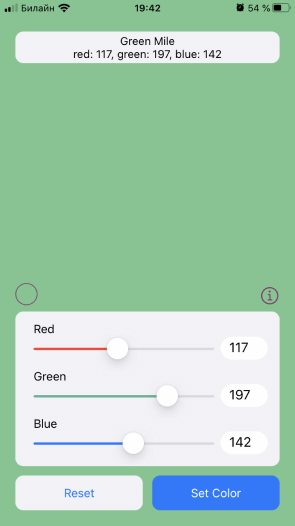

# Pickasso
## RW iOS Bootcamp Assigment 1

**Pickasso** is a color picker for users to combine red, green and blue amounts to create millions of different colors. I built it specifically for assigment 01 of the RW iOS Bootcamp at https://www.raywenderlich.com/10529048-ios-bootcamp.

## Bio

**Author:** Johandre Delgado  
**Discord:** @TC: Johandre Delgado  
**Location:** Moscow, Russia  
**Profession:** Wannabe iOS Developer  
**Interests:** I'm a language teacher learning iOS development to put together educational apps. I love in-line skating and reading scientific papers that are always way above my head.
