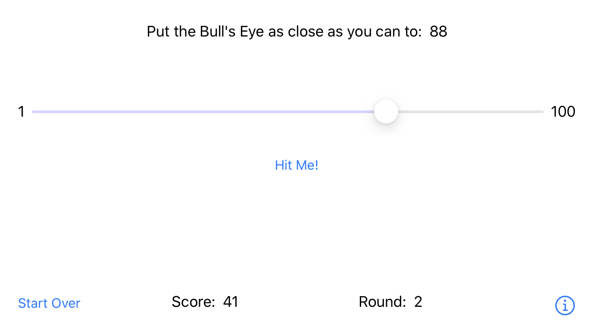

# BullsEyeGame
## RW iOS Bootcamp Assigment 2.1

This version of the famous **BullsEyeGame** focus on avoiding the infamous *massive viewcontroller* by moving the game logic out of the view controller into a UI-independent model type called **BullsEyeGame**. 

Although, Apple recommends to [use struts by default](https://developer.apple.com/documentation/swift/choosing_between_structures_and_classes), I decided to make BullsEyeGame a class since I care about is identity and I dont need copies of this object but prefered to pass it by reference, so all intances of it point to the same address in memory. Also, because I needed mutability.

Built it specifically for assigment 02 of the RW iOS Bootcamp at https://www.raywenderlich.com/10529048-ios-bootcamp.

