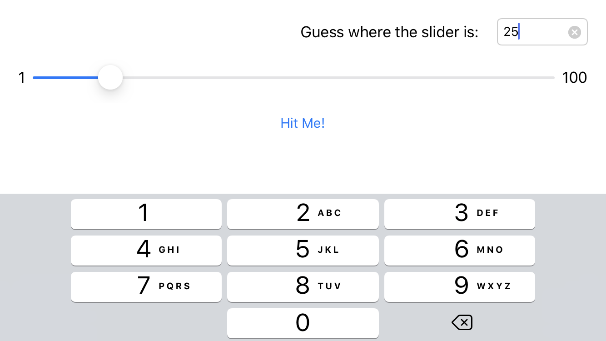

# RevBullsEye
## RW iOS Bootcamp Assigment 2.3

This is a reverse version of the famous **BullsEyeGame** . The idea is to use tha same game engine, **BullsEyeGame** , to run a different UI. Instead of moving the slider to match a displayed number, the game presents the slider with its thumb already positioned at the target value. The user then enters a guess for that value in a text field.

Built it specifically for assigment 02 of the RW iOS Bootcamp at https://www.raywenderlich.com/10529048-ios-bootcamp.

