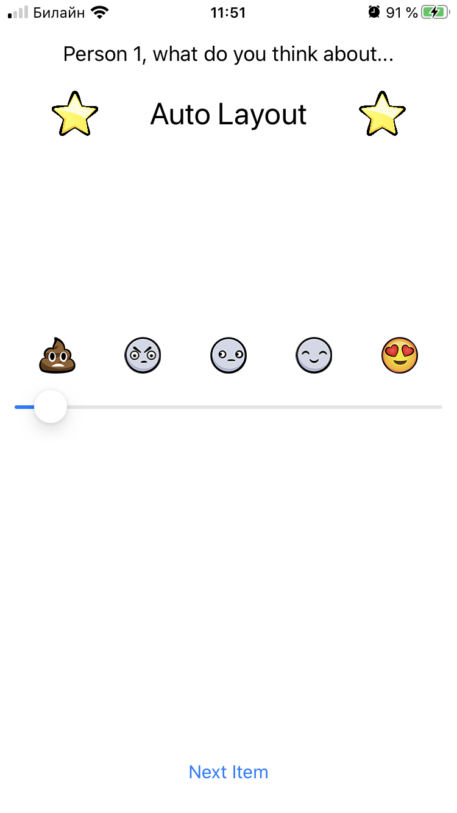

# CompatibilitySlider
## RW iOS Bootcamp Assigment 4.2

**CompatibilitySlider** is a a mini dating  demo app that polls two user's likes for several items and presents them with a compatibility score. Done to practice Auto Layout, Classes vs Structs and working with arrays. 

Build it specifically for assigment 04 of the RW iOS Bootcamp at https://www.raywenderlich.com/10529048-ios-bootcamp.

