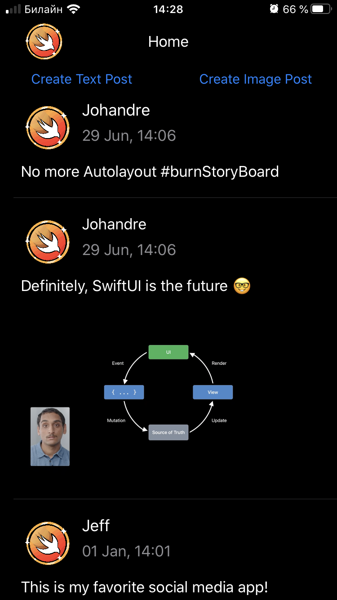
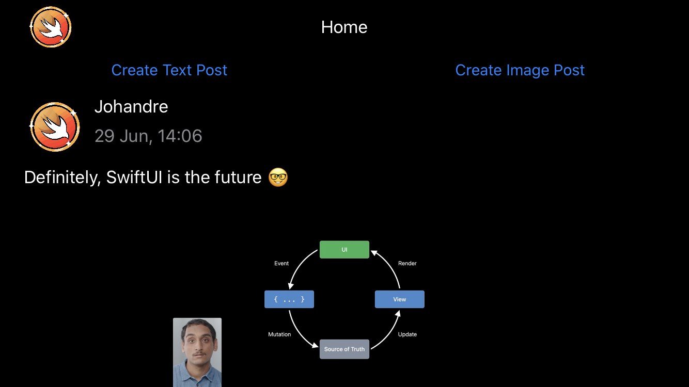

# Birdie
## RW iOS Bootcamp Assigment 5

**Birdie** is a A Twitter-like demo app that let the user send text and image messages. It demostrate the use of tableviews with different cell types and the use of UIImagePicker controller.  I built it specifically for assigment 05 of the RW iOS Bootcamp at https://www.raywenderlich.com/10529048-ios-bootcamp.

<kbd></kbd>
