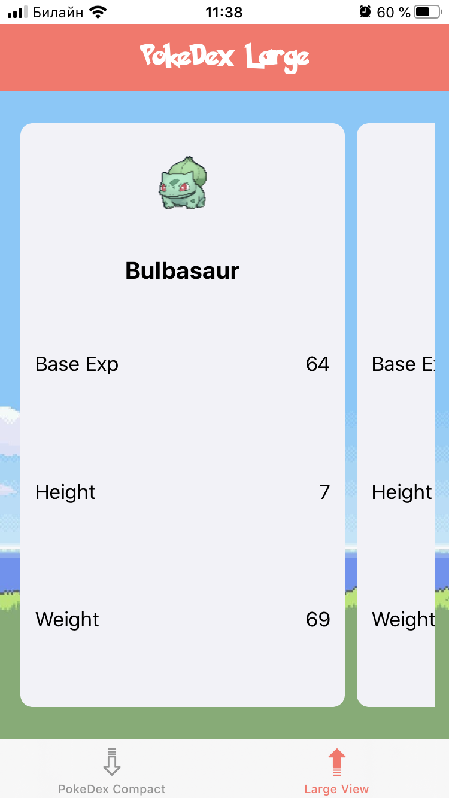

<!-- Header -->
<h1>Pokedex</h1>

<!-- Body -->
## RW iOS Bootcamp Assigment 6

**PokeDex**  is a collectionView centric demo app that allows you  to view your favorite pokemons in a vertical scrollable layout and also as a horizontally scrollable layout with larger cells.  It demostrate the use of CollectionViews with diffable datasources and compositional layouts  with different cell types. I built it specifically for assigment 06 of the firsts ever RW iOS Bootcamp at https://www.raywenderlich.com/10529048-ios-bootcamp.

## Screenshots

  <kbd></kbd>
  <kbd></kbd>

<!-- Footer -->
## Tech
- Swift 5
- Foundation
- UIKit
- iOS 13
