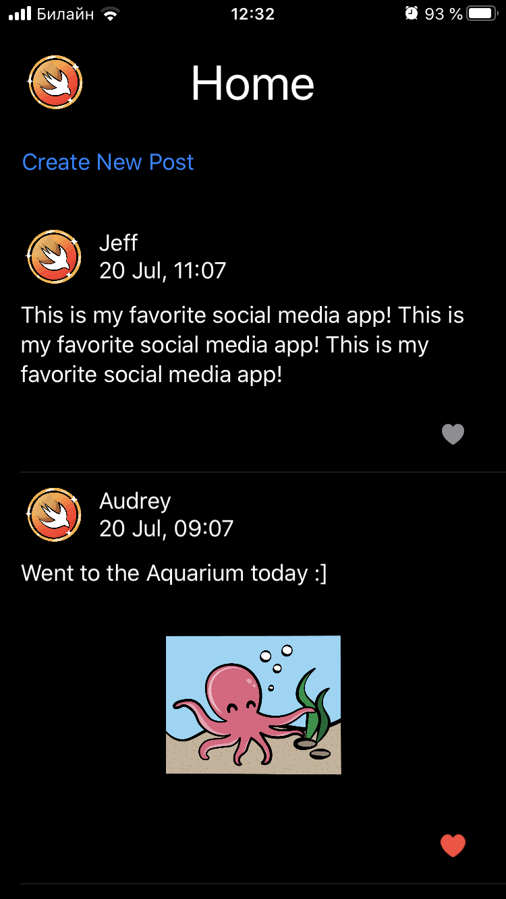
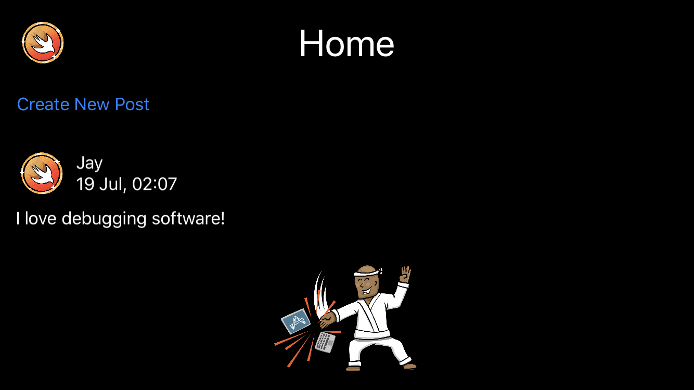
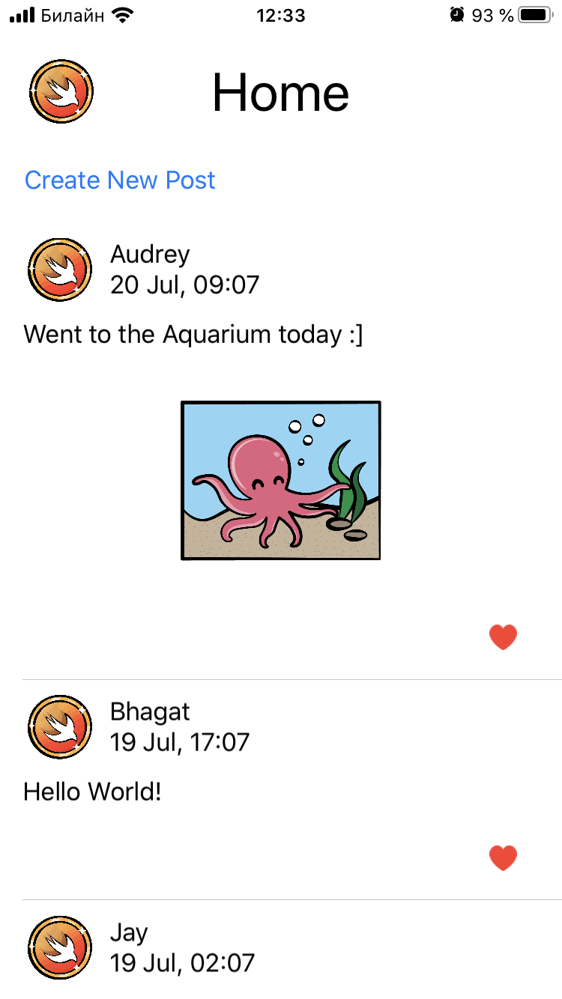
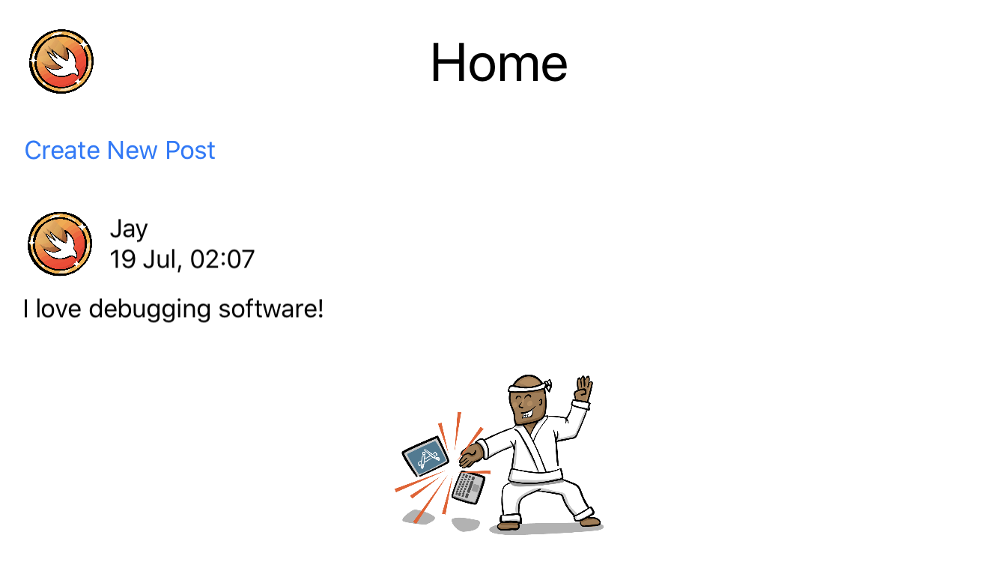

<!-- Header -->
<h1>BirdUI</h1>

<!-- Body -->
## RW iOS Bootcamp Assigment 7

**BirdUI**  is a SwiftUI version of the legendary Birdly app.  We did it in groups as an exercise in collaboration doing pull request, merging conflicts and reviewing collegues code before merging to the main branch. We built it specifically for assigment 07 of the first ever RW iOS Bootcamp at https://www.raywenderlich.com/10529048-ios-bootcamp.

[Code available in the Main repository.](https://github.com/reign0ver/BirdUI)

## Screenshots

  <kbd></kbd>
  <kbd></kbd>
  <kbd></kbd>
  <kbd></kbd>

<!-- Footer -->
## Tech
- Swift 5
- Foundation
- UIKit
- iOS 13
- Git
- GitHub PRs
