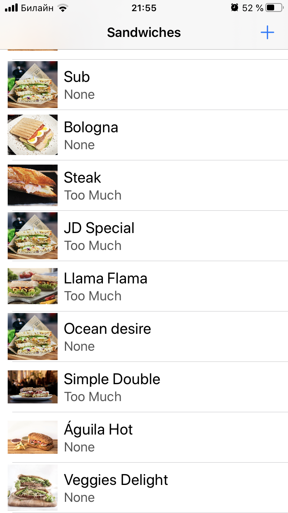
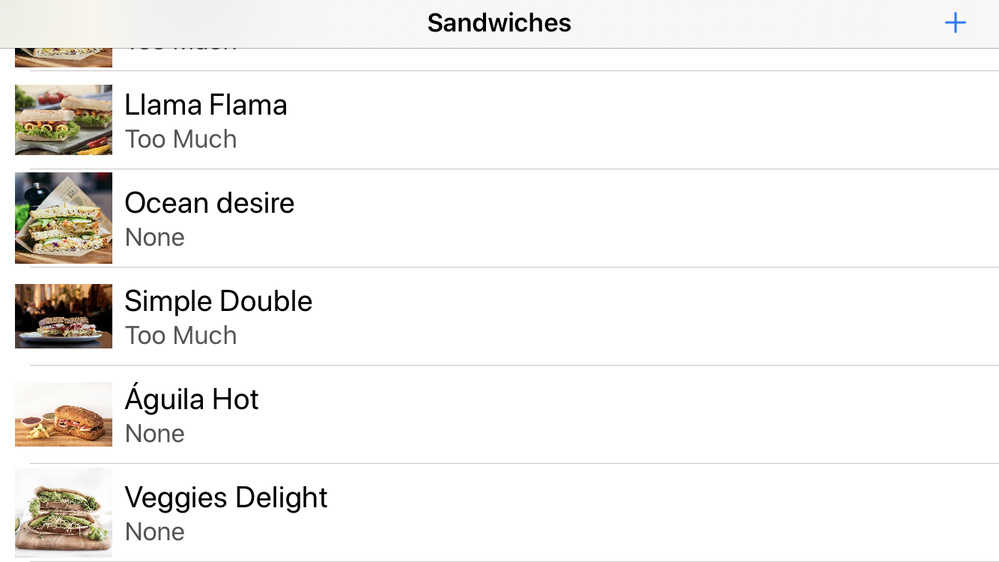

<!-- Header -->
<h1>Sandwich Saturation</h1>

<!-- Body -->
## RW iOS Bootcamp Assigment 8

**Sandwich Saturation**  is a restaurant menu app with a particular twist: The most important feature is how much salsa you want in your sandwich.  It demostrate the use of Core Data to add persintence between sections. Also, it uses Codable to parse JSON and prepopulate the database. I built it specifically for assigment 08 of the firsts ever RW iOS Bootcamp at https://www.raywenderlich.com/10529048-ios-bootcamp.

## Screenshots

  <kbd></kbd>
  <kbd></kbd>

<!-- Footer -->
## Tech
- Swift 5
- Foundation
- UIKit
- iOS 13
- Core Data
- Codable
