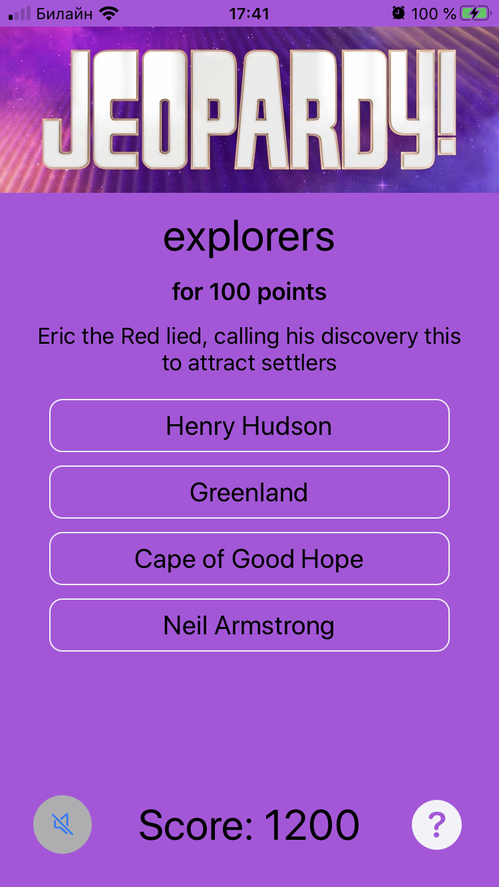
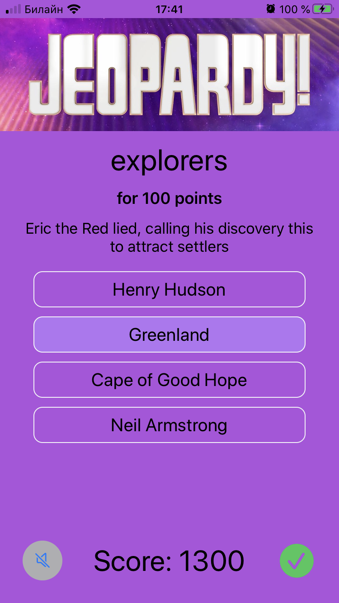

<!-- Header -->
<h1>jQuiz</h1>

<!-- Body -->
## RW iOS Bootcamp Assigment 9

**jQuiz**  is a Jeopardy based quiz app which consume the jservice API to present the user with 156,800 trivia questions from different categories.  It demostrate implementing networking code by leveling  completion blocks. Also, it uses Codable to parse JSON and convert it into local classes. I built it specifically for assigment 09 of the firsts ever RW iOS Bootcamp at https://www.raywenderlich.com/10529048-ios-bootcamp.

## Screenshots

  <kbd></kbd>
  <kbd></kbd>

<!-- Footer -->
## Tech
- Swift 5
- Foundation
- UIKit
- iOS 13
- REST API
- Codable
