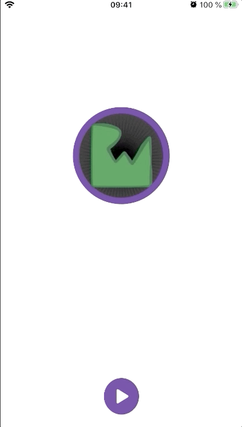
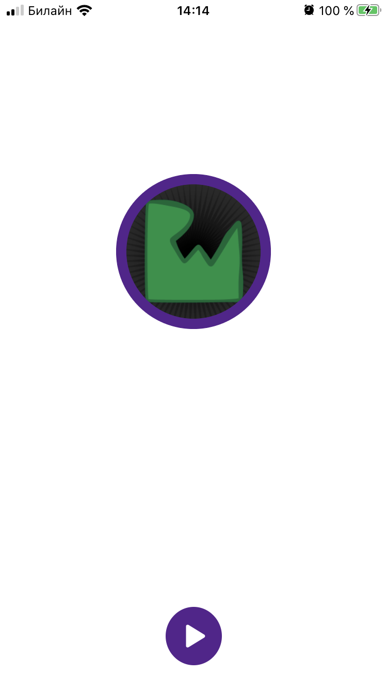
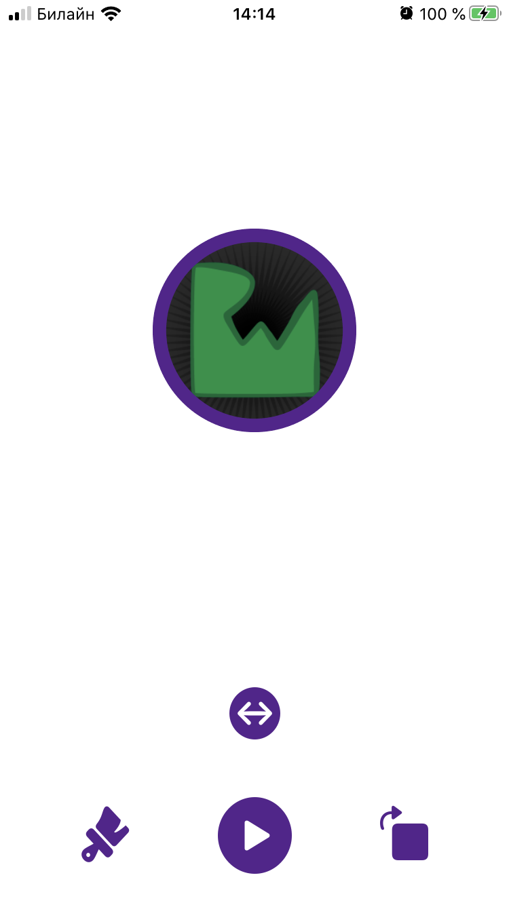
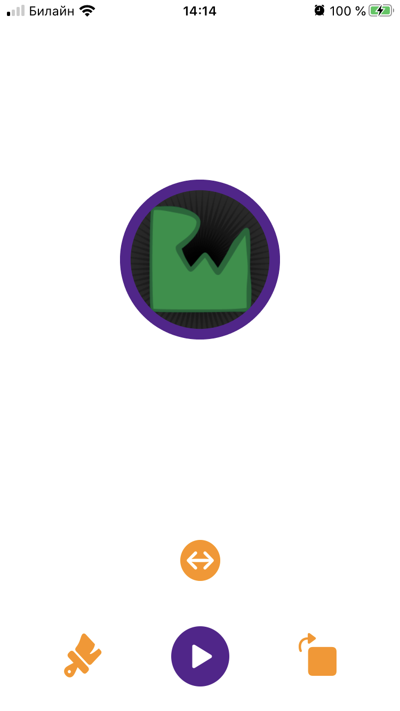
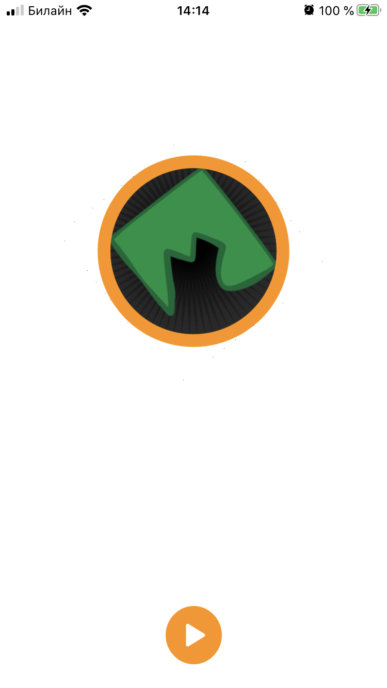
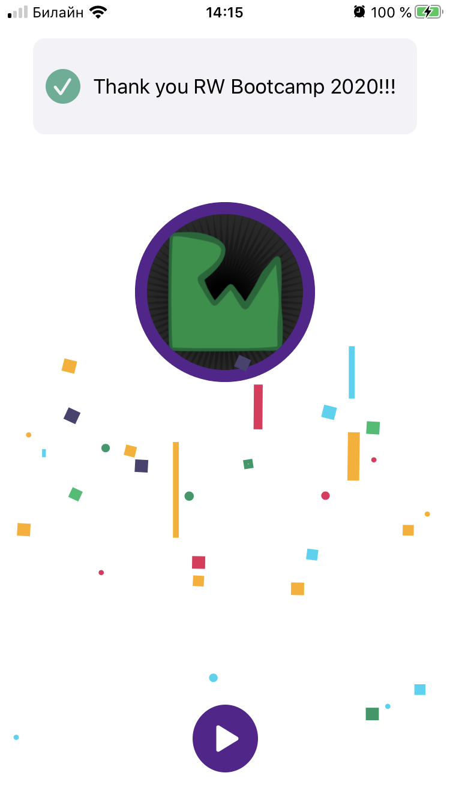

<!-- Header -->
<h1>Animatious</h1>

<!-- Body -->
## RW iOS Bootcamp Assigment 11

**Animatious**  is an app that let you choose animations and combine them to be apply to the animation object and play all the animations at once.  It demostrate implementing animation concatenation, delays and completion blocks. Also, if you tap the RW logo an extra animation is shown as an easter egg. I built it specifically for assigment 11 of the firsts ever RW iOS Bootcamp at https://www.raywenderlich.com/10529048-ios-bootcamp.

## Screenshots

  <kbd></kbd>
  <kbd></kbd>
  <kbd></kbd>
  <kbd></kbd>
  <kbd></kbd>
  <kbd></kbd>

<!-- Footer -->
## Tech
- Swift 5
- Foundation
- UIKit
- iOS 13
- UIView Animations
- Core Animation
- Lottie Animations
